This document includes an outline of the experiments testing the new iterative functions. 

We implemented three new functions that include the prior rate as a parameter:

1. Independent of the trial order, 0.5 * evidence, 0.5 * prior rate
2. Independent of the trial order, 1 - prior rate
3. Dependent on the trial order

```{r setup, include=FALSE}
knitr::opts_chunk$set(echo = TRUE)
```
**We ran the following experiments:**

**Exp. 1: individual optimization:**

**1. Independent of the trial order,  \code{0.5 * evidence, 0.5 * prior rate}**

*Ran the individual optimization for the following settings:*

  a) *One parameter optimization*
      - Optimize: softness, fixed: obedience = 0, prior rate = 0.5 
      - Optimize: obedience, fixed: softness = 0, prior rate = 0.5
      
**2. Independent of the trial order,  prior rate**

*Ran the individual optimization for the following settings:*

  a) *One parameter optimization*
      - Optimize: softness, fixed: obedience = 0, prior rate = 0.5 
      - Optimize: obedience, fixed: softness = 0, prior rate = 0.5   
      - Optimize: prior rate, fixed: softness = 0, obedience = 0   
      
  b) *Two parameter optimization*
      - Optimize: softness and prior rate, fixed: obedience = 0, prior rate = 0.5 
      - Optimize: softness and prior rate, fixed: obedience = 0.1, prior rate = 0.5   
      - Optimize: obedience and prior rate, fixed: softness = 0
      
**3. Dependent on the trial order**

*Ran the individual optimization for the following settings:*

  a) *One parameter optimization*
      - Optimize: softness, fixed: obedience = 0
      - Optimize: softness, fixed: obedience = 0.1
      - Optimize: obedience, fixed: softness = 0
      
  b) *Two parameter optimization*
      - Optimize: softness and obedience
      
        
**Exp. 2: global optimization:**

**1. Independent of the trial order,  \code{0.5 * evidence, 0.5 * prior rate}**

*Ran the individual optimization for the following settings:*

  a) *One parameter optimization*
      - Optimize: softness, fixed: obedience = 0, prior rate = 0.5 
      - Optimize: obedience, fixed: softness = 0, prior rate = 0.5
      
**2. Independent of the trial order,  prior rate**

*Ran the individual optimization for the following settings:*

  a) *One parameter optimization*
      - Optimize: softness, fixed: obedience = 0, prior rate = 0.5 
      - Optimize: obedience, fixed: softness = 0, prior rate = 0.5   
      - Optimize: prior rate, fixed: softness = 0, obedience = 0   
      
  b) *Two parameter optimization*
      - Optimize: softness and prior rate, fixed: obedience = 0, prior rate = 0.5 
      - Optimize: softness and prior rate, fixed: obedience = 0.1, prior rate = 0.5   
      - Optimize: obedience and prior rate, fixed: softness = 0
      
      
**3. Dependent on the trial order**

*Ran the individual optimization for the following settings:*
  a) *One parameter optimization*
      - Optimize: softness, fixed: obedience = 0
      - Optimize: softness, fixed: obedience = 0.1
      - Optimize: obedience, fixed: softness = 0
      
  b) *Two parameter optimization*
      - Optimize: softness and obedience

### Results of Exp. 1a:

#### Function 1: Indepenent of trial order (half evidence, half prior rate)
#### Summary of optimized parameter values (TABLE 1)

|          | V2: softness  | V3: obedience|
|:--------:|:-------------:|:------------:|
|   Min.  | 0.000e+00      | 0.000e+00    |
| 1st Qu. | 0.000e+00      | 0.000e+00    |
|  Median | 0.000e+00      | 9.998e+09    | 
|   Mean  | 3.128e+08      | 6.104e+09    |    
| 3rd Qu. | 0.000e+00      | 9.999e+09    | 
|   Max.  | 9.999e+09      | 1.000e+10    | 


#### Observations: 

******

#### Function 2: Independent of trial order (1 - prior rate)
#### Summary of optimized parameter values (TABLE 2)

| | V2: softness | V3: obedience | V4: prior rate | V5:13 pref, obed=0 | V6: 13 pr, obed=0 | V7: 13 pref, obed=0.1 | V8: 13 pr, obed=0.1 | V9: 23 obed, pref=0 | V10: 23 pr, pref=0 |
|:--------:|:-------------:|:------------:|:-------------:|:------------:|:-------------:|:------------:|:-------------:|:------------:|:--------:|
|   Min.  | 0.000e+00 | 0.000e+00 | 0.0118 | 0.00000 | 0.0000 | 0.00000  | 0.0000 | 0.000    | 0.006449 | 
| 1st Qu. | 0.000e+00 | 0.000e+00 | 0.5429 | 0.00000 | 0.3903 | 0.00000  | 0.4435 | 0.001    | 0.561760  |
|  Median | 0.000e+00 | 9.998e+09 | 0.6767 | 0.00000 | 0.6400 | 0.00855  | 0.6203 | 0.001    | 0.681491 |
|   Mean  | 3.128e+08 | 6.104e+09 | 0.6524 | 0.33530 | 0.5505 | 0.38697  | 0.5497 | 197.471  | 0.658794  |
| 3rd Qu. | 0.000e+00 | 9.999e+09 | 0.7963 | 0.09233 | 0.7269 | 0.06801  | 0.7109 | 17.299   | 0.793501  |
|   Max.  | 9.999e+09 | 1.000e+10 | 0.9999 | 9.17083 | 1.0000 | 9.74857  | 1.0000 | 4175.553 | 1.000000  |


#### Observations: 

******

#### Function 3: Dependent on trial order
#### Summary of optimized parameter values (TABLE 3)

|  | V2: pref, obed = 0 | V3: pref, obed = 0.1| V4: obedience | V5:12 pref | V6: 12 obed |
|:-------:|:-------------:|:------------:|:--------------:|:------------:|:-------------:|
|   Min.  | 0.000e+00     | 0.000e+00    | 0.000e+00      | 0       |  0    |
| 1st Qu. | 0.000e+00     | 0.000e+00    | 0.000e+00      | 0       |  0    | 
|  Median | 0.000e+00     | 0.000e+00    | 1.000e+00      | 0       |  0    |
|   Mean  | 5.262e+08     | 4.208e+08    | 4.100e+09      | 654638  | 124852|
| 3rd Qu. | 0.000e+00     | 0.000e+00    | 9.999e+09      |0        |  1    |
|   Max.  | 1.000e+10     | 1.000e+10    | 1.000e+10      |60474613 | 8396282|


#### Observation


******
### Model summaries, confidence intervals and comparison of the scatter plots
### Function 1:

#### default parameters

    lm(formula = rsaModel ~ workerData)

    Residuals:
        Min      1Q  Median      3Q     Max 
    -0.6955 -0.1241 -0.0152  0.1293  0.7692 
    
    Coefficients:
                Estimate Std. Error t value Pr(>|t|)    
    (Intercept) 0.135583   0.008548   15.86   <2e-16 ***
    workerData  0.593248   0.019540   30.36   <2e-16 ***
    ---
    Signif. codes:  0 ‘***’ 0.001 ‘**’ 0.01 ‘*’ 0.05 ‘.’ 0.1 ‘ ’ 1
    
    Residual standard error: 0.1869 on 1138 degrees of freedom
    Multiple R-squared:  0.4475,	Adjusted R-squared:  0.447 
    F-statistic: 921.8 on 1 and 1138 DF,  p-value: < 2.2e-16


#### Confidence intervals

                     2.5 %    97.5 %
      (Intercept) 0.1188111 0.1523554
      workerData  0.5549096 0.6315872

### 1 parameter optimization: softness (1st parameter)
#### after optimization

      lm(formula = rsaModel2 ~ workerData)
      
      Residuals:
           Min       1Q   Median       3Q      Max 
      -0.42931 -0.09235 -0.00655  0.08616  0.58796 
      
      Coefficients:
                  Estimate Std. Error t value Pr(>|t|)    
      (Intercept) 0.169524   0.006214   27.28   <2e-16 ***
      workerData  0.491428   0.014204   34.60   <2e-16 ***
      ---
      Signif. codes:  0 ‘***’ 0.001 ‘**’ 0.01 ‘*’ 0.05 ‘.’ 0.1 ‘ ’ 1
      
      Residual standard error: 0.1359 on 1138 degrees of freedom
      Multiple R-squared:  0.5126,	Adjusted R-squared:  0.5122 
      F-statistic:  1197 on 1 and 1138 DF,  p-value: < 2.2e-16

#### Confidence intervals

                  2.5 %    97.5 %
    (Intercept) 0.1573318 0.1817153
    workerData  0.4635597 0.5192971

### 1 parameter optimization: obedience (2nd parameter)
#### after optimzation:

    lm(formula = rsaModel2 ~ workerData)
    
    Residuals:
         Min       1Q   Median       3Q      Max 
    -0.61115 -0.11592 -0.02787  0.10831  0.64639 
    
    Coefficients:
                Estimate Std. Error t value Pr(>|t|)    
    (Intercept) 0.111091   0.007891   14.08   <2e-16 ***
    workerData  0.666727   0.018039   36.96   <2e-16 ***
    ---
    Signif. codes:  0 ‘***’ 0.001 ‘**’ 0.01 ‘*’ 0.05 ‘.’ 0.1 ‘ ’ 1
    
    Residual standard error: 0.1726 on 1138 degrees of freedom
    Multiple R-squared:  0.5455,	Adjusted R-squared:  0.5451 
    F-statistic:  1366 on 1 and 1138 DF,  p-value: < 2.2e-16


#### Confidence interval

                      2.5 %    97.5 %
      (Intercept) 0.09560789 0.1265749
      workerData  0.63133334 0.7021197
    

### Comparing Plots
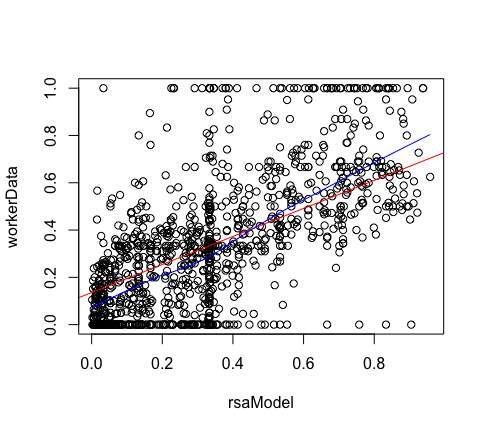{width=35%}

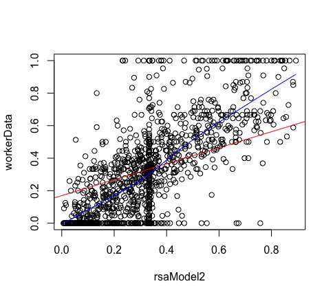{width=35%}

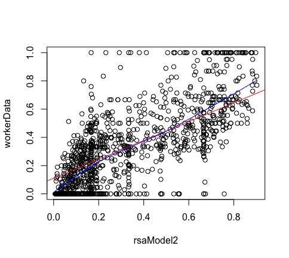{width=35%}

******

### Function 2:
#### default parameters

    lm(formula = rsaModel ~ workerData)
    
    Residuals:
        Min      1Q  Median      3Q     Max 
    -0.6955 -0.1241 -0.0152  0.1293  0.7692 
    
    Coefficients:
                Estimate Std. Error t value Pr(>|t|)    
    (Intercept) 0.135583   0.008548   15.86   <2e-16 ***
    workerData  0.593248   0.019540   30.36   <2e-16 ***
    ---
    Signif. codes:  0 ‘***’ 0.001 ‘**’ 0.01 ‘*’ 0.05 ‘.’ 0.1 ‘ ’ 1
    
    Residual standard error: 0.1869 on 1138 degrees of freedom
    Multiple R-squared:  0.4475,	Adjusted R-squared:  0.447
    F-statistic: 921.8 on 1 and 1138 DF,  p-value: < 2.2e-16

#### Confidence intervals 

                    2.5 %    97.5 %
    (Intercept) 0.1188111 0.1523554
    workerData  0.5549096 0.6315872
    
#### 1 parameter optimization: softness (1st parameter)
##### after optimization

    lm(formula = rsaModel2 ~ workerData)
    
    Residuals:
         Min       1Q   Median       3Q      Max 
    -0.42931 -0.09235 -0.00655  0.08616  0.58796 
    
    Coefficients:
                Estimate Std. Error t value Pr(>|t|)    
    (Intercept) 0.169524   0.006214   27.28   <2e-16 ***
    workerData  0.491428   0.014204   34.60   <2e-16 ***
    ---
    Signif. codes:  0 ‘***’ 0.001 ‘**’ 0.01 ‘*’ 0.05 ‘.’ 0.1 ‘ ’ 1
    
    Residual standard error: 0.1359 on 1138 degrees of freedom
    Multiple R-squared:  0.5126,	Adjusted R-squared:  0.5122 
    F-statistic:  1197 on 1 and 1138 DF,  p-value: < 2.2e-16


#### Confidence interval     

                    2.5 %    97.5 %
    (Intercept) 0.1573318 0.1817153
    workerData  0.4635597 0.5192971
    
### 1 parameter optimization: obedience (2nd parameter)
#### after optimization

      lm(formula = rsaModel2 ~ workerData)
      
      Residuals:
           Min       1Q   Median       3Q      Max 
      -0.61115 -0.11592 -0.02787  0.10831  0.64639 
      
      Coefficients:
                  Estimate Std. Error t value Pr(>|t|)    
      (Intercept) 0.111091   0.007891   14.08   <2e-16 ***
      workerData  0.666727   0.018039   36.96   <2e-16 ***
      ---
      Signif. codes:  0 ‘***’ 0.001 ‘**’ 0.01 ‘*’ 0.05 ‘.’ 0.1 ‘ ’ 1
      
      Residual standard error: 0.1726 on 1138 degrees of freedom
      Multiple R-squared:  0.5455,	Adjusted R-squared:  0.5451 
      F-statistic:  1366 on 1 and 1138 DF,  p-value: < 2.2e-16


#### Confidence intervals

                     2.5 %    97.5 %
    (Intercept) 0.09560789 0.1265749
    workerData  0.63133334 0.7021197


### 1 parameter optimization: prior rate (3rd parameter)
#### after optimization:
      
    lm(formula = rsaModel2 ~ workerData)
    
    Residuals:
         Min       1Q   Median       3Q      Max 
    -0.47004 -0.09519 -0.00898  0.08886  0.59859 
    
    Coefficients:
                Estimate Std. Error t value Pr(>|t|)    
    (Intercept) 0.158886   0.006443   24.66   <2e-16 ***
    workerData  0.523343   0.014728   35.53   <2e-16 ***
    ---
    Signif. codes:  0 ‘***’ 0.001 ‘**’ 0.01 ‘*’ 0.05 ‘.’ 0.1 ‘ ’ 1
    
    Residual standard error: 0.1409 on 1138 degrees of freedom
    Multiple R-squared:  0.526,	Adjusted R-squared:  0.5256 
    F-statistic:  1263 on 1 and 1138 DF,  p-value: < 2.2e-16

#### Confidence intervals

                    2.5 %    97.5 %
    (Intercept) 0.1462443 0.1715268
    workerData  0.4944470 0.5522394
    
### 2 parameter optimization: softness and prior rate, obedience = 0 (1st and 3rd parameter)
#### after optimization:
  
    lm(formula = rsaModel2 ~ workerData)
    
    Residuals:
         Min       1Q   Median       3Q      Max 
    -0.35346 -0.06564  0.00000  0.07310  0.43520 
    
    Coefficients:
                Estimate Std. Error t value Pr(>|t|)    
    (Intercept)  0.23761    0.00464   51.21   <2e-16 ***
    workerData   0.28716    0.01061   27.07   <2e-16 ***
    ---
    Signif. codes:  0 ‘***’ 0.001 ‘**’ 0.01 ‘*’ 0.05 ‘.’ 0.1 ‘ ’ 1
    
    Residual standard error: 0.1015 on 1138 degrees of freedom
    Multiple R-squared:  0.3918,	Adjusted R-squared:  0.3912 
    F-statistic:   733 on 1 and 1138 DF,  p-value: < 2.2e-16

#### Confidence intervals

                    2.5 %    97.5 %
    (Intercept) 0.2285089 0.2467167
    workerData  0.2663460 0.3079666
    
### 2 parameter optimization: softness and prior rate, obedience = 0.1 (1st and 3rd parameter)
#### after optimization:
    
    lm(formula = rsaModel2 ~ workerData)
    
    Residuals:
         Min       1Q   Median       3Q      Max 
    -0.48862 -0.07807 -0.00170  0.06532  0.53286 
    
    Coefficients:
                Estimate Std. Error t value Pr(>|t|)    
    (Intercept)  0.19729    0.00549   35.94   <2e-16 ***
    workerData   0.40812    0.01255   32.52   <2e-16 ***
    ---
    Signif. codes:  0 ‘***’ 0.001 ‘**’ 0.01 ‘*’ 0.05 ‘.’ 0.1 ‘ ’ 1
    
    Residual standard error: 0.12 on 1138 degrees of freedom
    Multiple R-squared:  0.4817,	Adjusted R-squared:  0.4812 
    F-statistic:  1058 on 1 and 1138 DF,  p-value: < 2.2e-16

#### Confidence intervals

                    2.5 %    97.5 %
    (Intercept) 0.1865219 0.2080650
    workerData  0.3834957 0.4327404
    
    
### 2 parameter optimization: obedience and prior rate, softness = 0 (2nd and 3rd parameter)
#### after optimization:
    
    lm(formula = rsaModel2 ~ workerData)
    
    Residuals:
         Min       1Q   Median       3Q      Max 
    -0.43849 -0.06961 -0.00380  0.06084  0.44325 
    
    Coefficients:
                Estimate Std. Error t value Pr(>|t|)    
    (Intercept) 0.206848   0.005124   40.37   <2e-16 ***
    workerData  0.379453   0.011714   32.39   <2e-16 ***
    ---
    Signif. codes:  0 ‘***’ 0.001 ‘**’ 0.01 ‘*’ 0.05 ‘.’ 0.1 ‘ ’ 1
    
    Residual standard error: 0.1121 on 1138 degrees of freedom
    Multiple R-squared:  0.4797,	Adjusted R-squared:  0.4793 
    F-statistic:  1049 on 1 and 1138 DF,  p-value: < 2.2e-16

#### Confidence intervals

                    2.5 %    97.5 %
    (Intercept) 0.1967939 0.2169024
    workerData  0.3564706 0.4024358
        
### Comparing Plots
{width=30%} 

{width=35%}

{width=35%}

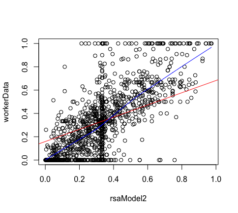{width=35%}

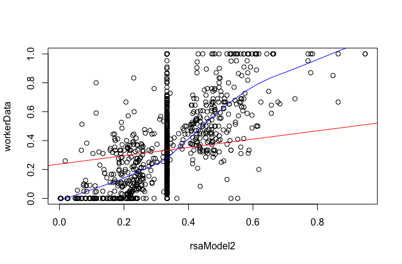{width=50%}

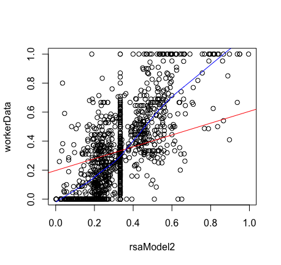{width=35%}

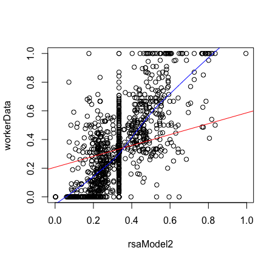{width=35%}

### Function 3
#### default parameters
    lm(formula = rsaModel ~ workerData)
    
    Residuals:
         Min       1Q   Median       3Q      Max 
    -0.53577 -0.15431 -0.03372  0.12938  0.75760 
    
    Coefficients:
                Estimate Std. Error t value Pr(>|t|)    
    (Intercept) 0.194303   0.009186   21.15   <2e-16 ***
    workerData  0.417091   0.020998   19.86   <2e-16 ***
    ---
    Signif. codes:  0 ‘***’ 0.001 ‘**’ 0.01 ‘*’ 0.05 ‘.’ 0.1 ‘ ’ 1
    
    Residual standard error: 0.2009 on 1138 degrees of freedom
    Multiple R-squared:  0.2574,	Adjusted R-squared:  0.2568 
    F-statistic: 394.6 on 1 and 1138 DF,  p-value: < 2.2e-16

#### confidence interval

                    2.5 %    97.5 %
    (Intercept) 0.1762799 0.2123267
    workerData  0.3758918 0.4582898
    
### 1 parameter optimization: softness (1st parameter), obed = 0
#### after optimization

    lm(formula = rsaModel2 ~ workerData)
    
    Residuals:
         Min       1Q   Median       3Q      Max 
    -0.50057 -0.13529 -0.02994  0.10369  0.70786 
    
    Coefficients:
                Estimate Std. Error t value Pr(>|t|)    
    (Intercept) 0.211900   0.008157   25.98   <2e-16 ***
    workerData  0.364301   0.018646   19.54   <2e-16 ***
    ---
    Signif. codes:  0 ‘***’ 0.001 ‘**’ 0.01 ‘*’ 0.05 ‘.’ 0.1 ‘ ’ 1
    
    Residual standard error: 0.1784 on 1138 degrees of freedom
    Multiple R-squared:  0.2512,	Adjusted R-squared:  0.2505 
    F-statistic: 381.7 on 1 and 1138 DF,  p-value: < 2.2e-16

#### confidence interval

                  2.5 %    97.5 %
    (Intercept) 0.1958953 0.2279043
    workerData  0.3277164 0.4008846

### 1 parameter optimization: softness (1st parameter), obed = 0.1
#### after optimization
  
    lm(formula = rsaModel2 ~ workerData)
    
    Residuals:
         Min       1Q   Median       3Q      Max 
    -0.52404 -0.13298 -0.03373  0.11456  0.73526 
    
    Coefficients:
                Estimate Std. Error t value Pr(>|t|)    
    (Intercept) 0.184497   0.008349    22.1   <2e-16 ***
    workerData  0.446510   0.019084    23.4   <2e-16 ***
    ---
    Signif. codes:  0 ‘***’ 0.001 ‘**’ 0.01 ‘*’ 0.05 ‘.’ 0.1 ‘ ’ 1
    
    Residual standard error: 0.1826 on 1138 degrees of freedom
    Multiple R-squared:  0.3248,	Adjusted R-squared:  0.3242 
    F-statistic: 547.4 on 1 and 1138 DF,  p-value: < 2.2e-16

#### confidence interval

                    2.5 %    97.5 %
    (Intercept) 0.1681161 0.2008776
    workerData  0.4090655 0.4839538

### 1 parameter optimization: obedience (2nd paramter), soft = 0
#### after optimization

    lm(formula = rsaModel2 ~ workerData)
    
    Residuals:
         Min       1Q   Median       3Q      Max 
    -0.54434 -0.14648 -0.04632  0.13765  0.74541 
    
    Coefficients:
                Estimate Std. Error t value Pr(>|t|)    
    (Intercept) 0.174345   0.009095   19.17   <2e-16 ***
    workerData  0.476964   0.020791   22.94   <2e-16 ***
    ---
    Signif. codes:  0 ‘***’ 0.001 ‘**’ 0.01 ‘*’ 0.05 ‘.’ 0.1 ‘ ’ 1
    
    Residual standard error: 0.1989 on 1138 degrees of freedom
    Multiple R-squared:  0.3162,	Adjusted R-squared:  0.3156 
    F-statistic: 526.3 on 1 and 1138 DF,  p-value: < 2.2e-16

#### confidence interval

                    2.5 %    97.5 %
    (Intercept) 0.1565000 0.1921907
    workerData  0.4361721 0.5177564


### two parameter optmization: softness and obedience
#### after optimization
    
    lm(formula = rsaModel2 ~ workerData)
    
    Residuals:
         Min       1Q   Median       3Q      Max 
    -0.56052 -0.13900 -0.03787  0.12659  0.77862 
    
    Coefficients:
                Estimate Std. Error t value Pr(>|t|)    
    (Intercept) 0.173284   0.008816   19.66   <2e-16 ***
    workerData  0.480149   0.020153   23.82   <2e-16 ***
    ---
    Signif. codes:  0 ‘***’ 0.001 ‘**’ 0.01 ‘*’ 0.05 ‘.’ 0.1 ‘ ’ 1
    
    Residual standard error: 0.1928 on 1138 degrees of freedom
    Multiple R-squared:  0.3328,	Adjusted R-squared:  0.3322 
    F-statistic: 567.6 on 1 and 1138 DF,  p-value: < 2.2e-16

#### Confidence Interval

                    2.5 %    97.5 %
    (Intercept) 0.1559856 0.1905819
    workerData  0.4406078 0.5196903

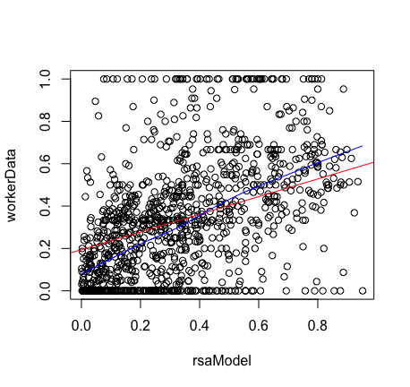{width=35%}

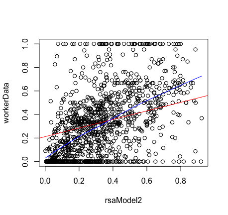{width=35%}

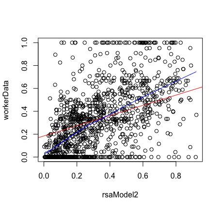{width=35%}

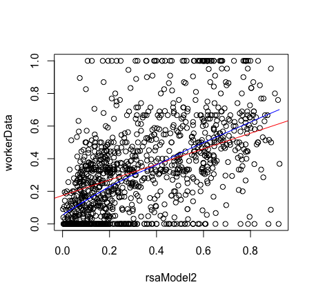{width=35%}

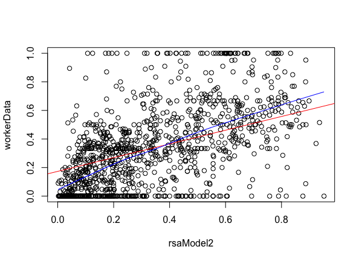{width=50%}

### Issues that need clarifying:

* Individual optimization: High values of the parameters softness and obedience when optimized alone (see TABLE 1 and 2: column 2 and 3)
* Individual optimization: High values of the parameters softness and obedience when optimized together (see Table 3: columns 5 and 6). --> Check for correlation 

* Global optimization error: Figured out what is causing the error: pp are not integers, as they should be. Debugging shows that pp is [,1][,2][,3]. This is not the case for the individual optimization, only for the global one.
* Further ideas: try optimizing the weights for the 3rd function (dependent on the trial)

